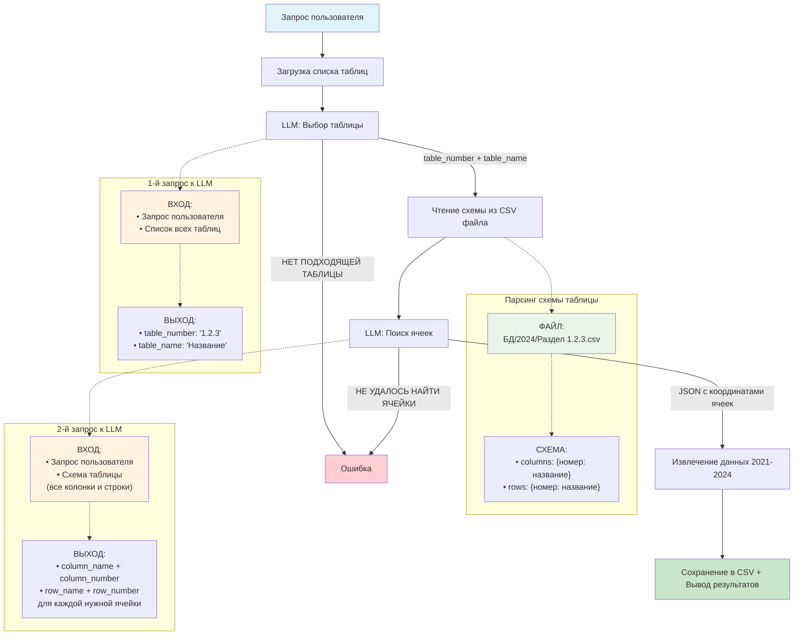

# Схема работы модуля обработки запросов к статистическим данным



## Этапы обработки запроса

### 1-й запрос к LLM: Выбор подходящей таблицы

**Что передается:**
- Запрос пользователя (например: "Сколько браков в России?")
- Полный список доступных таблиц с номерами (1.1, 1.2.1, 2.3.4 и т.д.)

**Что возвращает:**
```json
{
  "table_number": "1.2.3",
  "table_name": "Браки и разводы по регионам"
}
```

### Парсинг схемы таблицы (table_schema.py)

**Что происходит:**
- Открывается файл `БД/2024/Раздел 1.2.3.csv`
- Пропускаются первые 5 строк
- Из 6-й строки читаются номера колонок
- Из 7-й строки читаются названия колонок
- Начиная с 8-й строки читаются номера и названия строк

**Результат:**
```json
{
  "columns": {"1": "Всего", "2": "2021", "3": "2022", "4": "2023"},
  "rows": {"1": "Российская Федерация", "2": "Москва", "3": "СПб"}
}
```

### 2-й запрос к LLM: Поиск конкретных ячеек

**Что передается:**
- Тот же запрос пользователя
- Полная схема таблицы (все колонки и строки с номерами)

**Что возвращает:**
```json
{
  "cells": [
    {
      "column_name": "2023",
      "column_number": 4,
      "row_name": "Российская Федерация",
      "row_number": 1
    }
  ]
}
```

### Результат работы:

Система извлекает данные из найденных ячеек за 2021-2024 годы и сохраняет в CSV файл в папке `query_log/`.